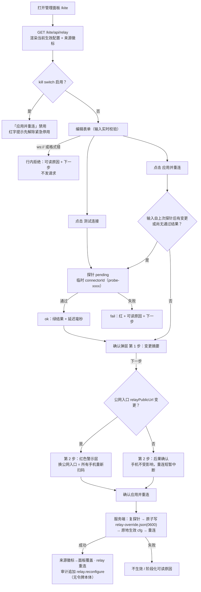

# 交互稿 · 中继接入（可视化配置）— dsh-kite 管理面板

> 依据：`docs/HANDOVER.md` §5（配置化设计，含 §5.5 三坑 / §5.6 安全边界 / §5.7 必须提示 / §5.8 刻意不做 / §5.9 验收口径）、`README.md` §3 配置与 §5 使用流程、`admin/panel.js` + `admin/panel-client.js` 现有视觉语言。
> 配套原型：`docs/prototype/relay-config-prototype.html`（自包含单文件，双击可开，内置模拟数据）。
> 版本：v1（2026-10-01）。平台：桌面浏览器（DSH Web GUI 内浮层 / `/kite` 独立页）。

---

## 1. 需求概述

- **背景**：换中继（VPS）目前要改 `cordis.patch.yml` 并重启 DSH，重启中断会话；且 profile patch 层不受插件控制（`compression: gzip` 曾被上层 patch 覆盖）。需要一个插件完全拥有的配置面（HANDOVER §5.1）。
- **目标用户**：在桌面 DSH 上打开管理面板的本机用户。面板走 `adminAuth` 三轨认证、主机专属；设备侧对 `/kite` 前缀直接 `deny(404,'reserved')`（§5.6 安全边界）——手机永远改不了中继地址。
- **核心场景**：换 VPS / 换域名 / 轮换令牌 → 面板里改地址与令牌 → 探针预检 → 两步确认 → 应用并重连，即时生效不重启；换公网入口时被醒目警告「所有手机要重新扫码」。
- **设计目标**：① 每个字段一眼看到**实际生效的来源**（env / 面板覆盖 / patch / 默认 徽标）；② 危险动作「先探针、再确认、后落盘」；③ 一切失败都有可读原因与「下一步该做什么」；④ 令牌**绝不回显**；⑤ 与现有面板同视觉语言（深色 #0e1116 / 卡片 #151a21 / 主色 #2f81f7），零新框架感。

---

## 2. 信息架构与页面流转

### 2.1 插入位置

现有面板结构（两个实现载体同步加区块）：

```
标题栏 → 中继状态卡 → 【★ 新增：中继接入（可视化配置）】 → 添加设备（扫码连接） → 已配对设备 → 宿主 API 探针 → 审计
```

- 载体 1：`admin/panel-client.js` 的 `openPanel()`——插入在 `statusCard` 之后、`pairHead`（「添加设备」标题）之前。
- 载体 2：`admin/panel.js` 的 `ADMIN_HTML`——插入在第一张状态 `.card` 之后、`<h2>添加设备（扫码连接）</h2>` 之前。

理由：配置是「中继状态」的直接下游——retrying/killed 时用户视线不用跳；同时排在「添加设备」之前，因为换公网入口后紧接着的动作就是重新扫码。

### 2.2 页面/状态流转



### 2.3 API 契约（供开发对齐，UI 依赖）

三个路由全部位于 `adminAuth` 之后（对齐 §5.4「沿用现有 adminAuth 门」与 §5.9 验收）：

| 路由 | 方法 | 请求 | 响应 |
|---|---|---|---|
| `/kite/api/relay` | GET | — | `{ effective: { relayUrl, relayPublicUrl, relayTokenSet, relayTokenFp }, sources: { relayUrl, relayToken, relayPublicUrl }, override: { exists, changedAt }, killswitch: { enabled }, relay: { state, lastError } }` |
| `/kite/api/relay/probe` | POST | `{ relayUrl, relayToken, relayPublicUrl }`（token 允许空串 = 服务端代以当前令牌） | `{ ok: true, code: 'ok', latencyMs }` 或 `{ ok: false, code: 'format'｜'dns'｜'timeout'｜'auth'｜'tls'｜'server', reason }` |
| `/kite/api/relay` | POST | `{ relayUrl, relayToken, relayPublicUrl }` | 成功 `{ ok: true, effective, sources }`；失败 `{ ok: false, stage: 'validate'｜'probe'｜'write'｜'reconnect', reason }` |

硬约束（写进实现与测试）：

- 任何响应**不含 relayToken 本体**，只含 `relayTokenSet` 布尔与 `relayTokenFp`（sha256 前 8 位，供用户比对凭据是否同一把）。
- 探针必须用**临时 connectorId**（`probe-<random>`）——复用本机 connectorId 会被中继 `close(4000,'replaced')` 踢掉在线连接（§5.5 坑 1）。
- 服务端同样**只收 `wss://`**，`ws://` 返回 400 + 可读原因（不信任前端校验，§5.5 坑 2）。
- killed 状态下 POST `/kite/api/relay` 返回 409 拒绝。
- 落盘 `relay-override.json` 用临时文件 + rename 原子写，`mode 0600`；文件缺失或损坏一律视为无覆盖、静默回退（与 killswitch.json 同构）。

---

## 3. 页面交互稿

### 3.1 线框图（新增区块）

```
┌ h2 中继接入（可视化配置）──────────────────────────────────────────────┐
│                                                                        │
│ ┌ card A · 当前生效配置 ─────────────────────────────────────────────┐ │
│ │ ① 优先级链  env ＞ relay-override.json（面板）＞ cordis.patch.yml ＞ 默认值 │
│ │ ② 中继地址   wss://198.51.100.10:8443                    [patch]   │
│ │ ③ 中继令牌   已设置 · 指纹 sha256:9f86d081…               [patch]   │
│ │              （永不回显：面板不保存、不显示令牌本体）                    │
│ │ ④ 公网入口   https://198.51.100.10:8443                  [派生]    │
│ │ ⑤ note：覆盖文件 …/plugin-data/dsh-kite/<profile>/relay-override.json │
│ │    （0600）· 更新于 2026-10-01 14:02 · 删除该文件即回退到下一优先级    │
│ │    （无迁移、无版本历史）                                             │
│ └────────────────────────────────────────────────────────────────────┘ │
│ ┌ card B · 修改配置 ─────────────────────────────────────────────────┐ │
│ │ ⑥ 中继地址   [ wss://relay.example.com:8443               ]        │
│ │    ⛔ 行内错误区（红字：原因 + 下一步；无错误时不占位）                 │
│ │ ⑦ 中继令牌   [ ●●●●●●●●●●●●                        ] [显示]        │
│ │    note：留空 = 沿用当前令牌（指纹 9f86d081…）；已存令牌不可查看       │
│ │ ⑧ 公网入口   [ https://relay.example.com:8443            ]          │
│ │    ☑ 自动派生（wss → https，手改即关）                                │
│ │ ⑨ [ 测试连接 ]   [ 应用并重连 ]                                       │
│ │    （killed / env 遮蔽 / 重扫码提示，按状态出现在此）                  │
│ │ ⑩ 探针结果区：pending 转圈 / ok 绿 / fail 红 + 可读原因 + 下一步       │
│ └────────────────────────────────────────────────────────────────────┘ │
└────────────────────────────────────────────────────────────────────────┘
   ↑ 插入于「中继状态卡」之后；下方紧接既有「添加设备（扫码连接）」
```

**确认弹层线框（两步）**

```
┌ 遮罩（同面板浮层 rgba(6,8,12,.66)）───────────────────────────────┐
│  ┌ 弹层卡片 ────────────────────────────────────────────────────┐ │
│  │  第 1/2 步 · 变更摘要                       ● ●○              │ │
│  │  ✓ 探针通过（84ms）                                           │ │
│  │  中继地址   wss://198.51.100.10:8443  →  wss://relay.example.com:8443 │
│  │  中继令牌   将更新 · 指纹变为 sha256:3b5d52fa…（应用后不可查看） │
│  │  公网入口   https://198.51.100.10:8443 → https://relay.example.com:8443 │
│  │                                            [取消]  [下一步]   │ │
│  └──────────────────────────────────────────────────────────────┘ │
│  ┌ 第 2/2 步（公网入口有变更时）────────────────────────────────┐ │
│  │  ┌ ⚠ 红底警示框 ──────────────────────────────────────────┐  │ │
│  │  │ 换公网入口 = 所有已配对手机都要重新扫码。                │  │ │
│  │  │ 设备私钥保存在手机浏览器 IndexedDB，按 origin 隔离；    │  │ │
│  │  │ 新入口 = 新 origin = 手机里没有私钥。应用后请到         │  │ │
│  │  │ 「添加设备」重新生成二维码，逐台重新配对。               │  │ │
│  │  └─────────────────────────────────────────────────────────┘  │ │
│  │  应用成功后审计区将出现 relay.reconfigure 事件（不含令牌本体， │ │
│  │  仅哈希前缀）。                                               │ │
│  │                               [取消]  [确认应用并重连]         │ │
│  └──────────────────────────────────────────────────────────────┘ │
└────────────────────────────────────────────────────────────────────┘
```

### 3.2 区块说明表

| 编号 | 元素 | 内容 / 数据来源 | 说明 |
|---|---|---|---|
| ① | 优先级链 | 静态文案 `env ＞ relay-override.json（面板）＞ cordis.patch.yml ＞ 默认值` | 与 §5.3 逐字一致；帮助用户理解徽标含义 |
| ② | 中继地址行 | `GET /kite/api/relay` → `effective.relayUrl` | mono 展示 + 来源徽标 |
| ③ | 中继令牌行 | `effective.relayTokenSet` + `effective.relayTokenFp` | **永不回显本体**，只显示「已设置 · 指纹 sha256:xxxxxxxx…」或「未设置」 |
| ④ | 公网入口行 | `effective.relayPublicUrl`；来源为 `derived` 时标注「派生」 | 派生规则：`wss://` → `https://`，host/port 原样保留（与现网 `https://<IP>:8443` 一致） |
| ⑤ | 覆盖文件说明 | `override.exists / changedAt` | 写明 0600、删除即回退（对齐 §5.8「删文件即回退」） |
| ⑥ | relayUrl 输入框 | 用户输入 | 校验见 §3.3；ws:// 被拒并解释原因 |
| ⑦ | relayToken 输入框 | 用户输入 | `type=password` + 「显示」切换（只影响正在输入的值，已存令牌永不显示） |
| ⑧ | relayPublicUrl 输入框 + 自动派生勾选 | 用户输入 / 自动派生 | 勾选时随 relayUrl 实时派生；手改即取消勾选 |
| ⑨ | 测试连接 / 应用并重连 | — | 规则见 §3.5；主按钮用 `.primary` 样式 |
| ⑩ | 探针结果区 | POST `/kite/api/relay/probe` | 状态机见 §3.6-B；pending 时注明「使用临时 connectorId，不影响在线连接」 |

### 3.3 字段规则表

| 字段 | 必填 | 校验规则（前端实时 + 服务端强制） | 来源徽标取值 | 空态 |
|---|---|---|---|---|
| 中继地址 relayUrl | 是 | ① 必须 `^wss://`（大小写不敏感）；② `new URL()` 可解析且 host 非空；③ 首尾空格自动去除。**`ws://`、`http://` 直接拒绝**并解释：明文降级 + 牵动 `secureCookies`（boot 期捕获，改 scheme 需重建配对/票据服务，§5.5 坑 2） | env / 面板覆盖 / patch / 默认 | 输入为空 → 两按钮禁用；展示区显示「未配置（待机）」 |
| 中继令牌 relayToken | 条件必填 | 应用时留空 = 沿用当前令牌（当前必须已有令牌，否则必填）；任何响应不回显；探针/应用请求体可带空串由服务端代填 | env / 面板覆盖 / patch / 默认 | 展示区「未设置」（红色 badge）；输入框占位「必填：与中继 RELAY_TOKENS 匹配」 |
| 公网入口 relayPublicUrl | 否 | 手输仅允许 `^https://`；为空时应用前按 `wss→https` 自动派生；派生不改变 port | env / 面板覆盖 / patch / **派生**（derived，视为默认层） | 空 = 「未配置（按 relayUrl 派生：https://…）」 |

来源徽标规范（沿用面板 badge 语言）：

| 来源 | 徽标文案 | 底色 / 字色 | 备注 |
|---|---|---|---|
| env | `env 优先` | `#3a2c12` / `#e3b341`（琥珀） | 额外在 card B 显示遮蔽警告（见 §3.5-R6） |
| 面板覆盖 | `面板覆盖` | `#123527` / `#7ee2b8`（绿） | relay-override.json 存在且生效 |
| patch | `patch` | `#2a303a` / `#9aa4b2` | cordis.patch.yml |
| 默认 / 派生 | `默认` / `派生` | `#2a303a` / `#6b7684` | 内置默认值 / 运行期派生 |

### 3.4 交互规则（逐元素：触发 → 过程反馈 → 结果）

**R1 · relayUrl 输入（⑥）**
- 触发：`input` 事件。
- 过程：为空 → 清除错误；以 `ws://` 开头 → 红字「仅支持 wss://：ws:// 是明文，会把远程入口降级，且牵动安全 Cookie 语义（secureCookies 在启动期捕获，改 scheme 需重建配对/票据服务）。本地联调请直接改 cordis.patch.yml 并重启 DSH。」；其它解析失败 → 红字「URL 无法解析，检查前缀与多余空格」。
- 结果：合法 → 错误清除；若「自动派生」勾选中 → 同步派生公网入口。

**R2 · relayToken 输入（⑦）与「显示」按钮**
- 触发：输入 / 点击「显示 ↔ 隐藏」。
- 过程：输入框 `type=password`；「显示」仅切换**正在输入的值**的可见性。
- 结果：已存令牌在任何界面、任何接口响应中都不可见；应用成功后该值即不可再查看，只有指纹可比对。

**R3 · relayPublicUrl 输入 + 自动派生（⑧）**
- 触发：输入框编辑 → 取消「自动派生」勾选（并提示「已切换为手动，可点『重新派生』恢复」）；勾选恢复 → 立即按当前 relayUrl 重新派生并回填。
- 结果：手输非法（非 https://）→ 红字行内错误；空值 → 应用时自动派生兜底。

**R4 · 「测试连接」（⑨ 左）**
- 触发：点击；禁用条件 = 探针进行中 / relayUrl 为空或不合法。（kill switch 时**保持可用**——探针是诊断动作，用临时 id，与 kill switch 互不影响。）
- 过程：按钮置灰文字「探针中…」；结果区转圈 +「探针中…（使用临时 connectorId probe-xxxx，不影响在线连接）」；上限 10s 服务端超时。
- 结果：
  - ok → 绿字「探针通过 · 84ms · 中继握手与令牌校验均正常」；
  - fail → 红字 + code + 可读原因 + 「下一步」（完整文案见 §5）；请求本身网络错误 → 「面板服务不可达：刷新页面或检查 DSH 进程」。
- 记录：通过结果与当时的输入签名绑定；输入再变更即失效（见 R5）。

**R5 · 「应用并重连」（⑨ 右）**
- 触发：点击；禁用条件 = kill switch / relayUrl 非法 / 探针或应用进行中 / `relayOwned === false`（中继被另一实例接管）。
- 过程（严格顺序，对齐「先探针通过再落盘」）：
  1. 输入与当前生效配置完全一致 → Toast「没有变更：输入与当前生效配置一致」，流程终止（防无效写盘）。
  2. 无有效探针结果**或**输入自探针后有变更 → 自动先跑探针，结果区显示「输入已变更，先重新探针…」；失败则终止并展示原因，**不弹确认层**。
  3. 探针通过 → 打开确认弹层**第 1 步（变更摘要）**：逐字段 old → new（mono），令牌只显示指纹变化。
  4. 「下一步」→ **第 2 步（后果确认）**：公网入口有变更 → 红底警示层（重新扫码警告，文案见 §3.1）；无变更 → 中性提示「已配对手机不受影响；重连期间远程访问会短暂中断（约 1–3 秒）」。
  5. 「确认应用并重连」→ 按钮文字「写入并重连中…」全程禁用（弹层内按钮同样防双击）；POST `/kite/api/relay`，服务端**再复探针一次**（不信任客户端缓存结果）→ 原子写 `relay-override.json`（0600）→ 原地生效 cfg → 重连。
- 结果（成功）：弹层关闭；Toast「已应用并重连 · relay-override.json 已写入（0600）」；card A 三枚来源徽标刷新（env 场景除外，见 R6）；顶部 relay 徽标 `connecting → open`；审计区**自动可见**新增行 `relay.reconfigure`（不含令牌本体，含 tokenFp 哈希前缀）；公网入口有变更时在按钮下方追加持久提示「已换公网入口：请到『添加设备』重新生成二维码，逐台重新扫码」直到下次输入变更。
- 结果（失败，阶段化）：`stage=validate/probe` → 红字原因（同探针文案）；`stage=write` → 「覆盖文件写入失败（磁盘或权限），配置未变更」；`stage=reconnect` → 覆盖已写入、relay 转入 `retrying` 徽标 + lastError，按钮下方黄字提示「已保存但重连失败：连接器正在自动重试。若中继地址确实不可达，可重新填入旧值再应用，或删除 relay-override.json 回退」（是否自动回滚见待确认 #1）。

**R6 · env 遮蔽警告（优先级链的可视化后果）**
- 触发：GET 结果中任一字段 `sources === 'env'`。
- 结果：card B 顶部常驻琥珀色警告框：「当前 relayUrl / 令牌由环境变量 DSH_KITE_RELAY_URL / DSH_KITE_RELAY_TOKEN 决定，优先级高于面板覆盖：应用的新值会写入 relay-override.json，但实际生效的仍是 env 值。如需让面板配置生效，请移除环境变量并重启 DSH。」应用仍允许（为后续铺路），成功后徽标保持 env 并追加说明。

**R7 · kill switch 联动**
- 触发：`killswitch.enabled === true`（顶部状态卡同步红色「已紧急停用」）。
- 结果：「应用并重连」禁用，按钮下方红字：「kill switch 生效中：连接器已断开并停止重连。请先在『已配对设备』区点击『紧急停用』解除后再应用新配置。」「测试连接」保持可用。

**R8 · 轮询与刷新**
- 现有 5s `/kite/api/status` 轮询与手动「刷新」继续工作；新增区块的**展示区**（card A、来源徽标、relay 徽标）随轮询更新，**永不覆写输入框与探针结果**（避免用户输入被打断）。
- 轮询发现 `override.exists` 从 true 变 false（文件被外部删除）→ card A 徽标自动回到 patch/默认，note 显示「面板覆盖已被移除（文件不存在或损坏），已回退到下一优先级」。

### 3.5（补）状态机

**A · relay 徽标状态机**（沿用现有五态，两处实现建议统一 retrying 用琥珀色）

| 状态 | 触发 | UI 表现 | 出口 |
|---|---|---|---|
| `standby` | relayUrl 为空 | 灰「待机（未配置中继）」 | → connecting（配置生效并启动重连） |
| `connecting` | 发起出站连接 | 灰「连接中」 | → open / retrying / killed |
| `open` | 握手 + 令牌校验成功 | 绿「已连接」 | → connecting（断线）/ retrying / killed |
| `retrying` | 连接失败进入退避重试 | 琥珀「重试中」+ note 追加 lastError | → open / killed |
| `killed` | kill switch 启用 | 红「已紧急停用」 | → standby/open（解除后按配置重启） |

**B · 探针状态机**

| 状态 | 触发 | UI 表现 | 出口 |
|---|---|---|---|
| `idle` | 初始 / 输入变更后失效 | 结果区隐藏 | → pending |
| `pending` | 点击测试连接 / 应用前自动探针 | 按钮禁用「探针中…」+ 临时 connectorId 说明 | → ok / fail（≤10s 强制超时） |
| `ok` | 握手 + 令牌校验通过 | 绿「探针通过 · Nms」 | → idle（输入变更或应用成功后失效） |
| `fail` | 任一失败码 | 红 + code + 原因 + 下一步 | → pending（重试）/ idle |

失败码与用户文案的一一对应见 §5 文案清单。

**C · 应用流程状态机**：`idle → probing(可选) → confirm-step1 → confirm-step2 → writing → done｜failed(stage)`。任一步取消/失败均回到 `idle`，不产生半生效状态（探针失败不落盘；写入与重连的阶段化结果见 R5）。

### 3.6 状态设计（默认 / 加载 / 空 / 错误 / 极限）

| 态 | 表现 |
|---|---|
| 默认态 | GET 成功：card A 三行值 + 徽标；card B 空输入 + 占位提示 |
| 加载态 | 「配置读取中…」note；区块骨架不闪烁（与状态卡一致的高度） |
| 空态 | 无覆盖文件 → 徽标 patch/默认 + note「当前没有面板覆盖（relay-override.json 不存在；文件损坏同样按无覆盖处理并静默回退）」 |
| 错误态 | GET 失败 → 区块内红字「配置接口不可达：<原因>」+ [重试] 按钮；探针失败各文案见 §5 |
| 极限态 | 超长 URL（mono + word-break 折行）；env 遮蔽（R6）；killed（R7）；`relayOwned=false`（「中继由另一 DSH 实例接管，请在该实例的面板操作」，两按钮全禁）；覆盖文件损坏（视为无覆盖 + note）；双击防抖（in-flight 全禁用） |

---

## 4. 全局交互规范

- **导航与返回**：不新增导航层级；确认弹层「取消」/ 遮罩点击 / Esc 均回到表单且不产生副作用。弹层打开时 Esc 优先关弹层并阻止冒泡，避免误关整个面板浮层（面板浮层本身 Esc 关闭）。
- **键盘**：表单内 Enter 触发「测试连接」（安全动作，绝不触发应用）；无其它快捷键。
- **防重复提交**：探针 in-flight 禁用两按钮；应用走「弹层确认 + in-flight 标志」双保险；服务端原子写（临时文件 + rename）保证幂等安全。
- **令牌纪律（§5.6）**：输入框不回显已存令牌；GET/POST 响应不含令牌本体；日志与审计只出现哈希前缀；`type=password` 防 shoulder-surfing。
- **埋点/留痕**：本插件无遥测。行为留痕走审计 `audit.jsonl`：仅 `relay.reconfigure`（应用成功）一条，`detail` 含 relayUrl / relayPublicUrl / `tokenFp: "sha256:xxxxxxxx"` / `source: "panel"`；探针**不落审计**（高频操作避免噪声），排障走服务端 debug 日志。

---

## 5. 异常与边界（可读文案清单）

每条 = 用户看到的文案 + 「下一步」指引。探针失败码对齐 §2.3 API：

| code | 文案（红字主句） | 下一步（灰字指引） |
|---|---|---|
| `format`（前端拦截 ws://） | 仅支持 wss://：ws:// 是明文，会把远程入口降级，且牵动安全 Cookie 语义（secureCookies 在启动期捕获，改 scheme 需重建配对/票据服务）。 | 本地联调请直接改 cordis.patch.yml 并重启 DSH。 |
| `format`（解析失败） | URL 无法解析：检查是否漏写 wss:// 前缀、有多余空格或非法字符。 | 示例：`wss://relay.example.com:8443` |
| `dns` | 域名解析失败（DNS）。 | 检查域名拼写与 DNS 记录；使用裸 IP 部署时不会出现此错误。 |
| `timeout` | 探针超时：中继 10 秒内无响应。 | ① 确认 VPS 中继服务在运行（`systemctl status ra-relay`）；② 云防火墙未放行端口时同样表现为持续超时（区别于服务未起的秒回 RST）；③ 在服务器本机自检：`curl --connect-to <ip>:<port>:127.0.0.1:<port> https://…/healthz`。 |
| `auth` | 令牌被中继拒绝（401）。 | 核对令牌与中继侧 RELAY_TOKENS 完全一致；复制时注意不要带换行或空格。 |
| `tls` | TLS 证书校验失败。 | 裸 IP 证书是 Let's Encrypt 7 天短期档、Caddy 自动续期；刚换 IP 时等待重签，或检查中继 TLS 配置路径。 |
| `server` | 中继握手异常（非预期响应）。 | 查看中继 `/healthz` 与日志；确认部署的是带解耦层的新版中继（`/metrics` 含 `wire_frame_limit` 行）。 |
| —（apply·write） | 覆盖文件写入失败（磁盘或权限），配置未变更。 | 检查 `$DSH_HOME/plugin-data/dsh-kite/<profile>/` 目录权限后重试。 |
| —（apply·reconnect） | 已保存但重连失败：连接器正在自动重试。 | 若新地址确实不可达，可重新填入旧值再应用，或删除 relay-override.json 回退。 |
| —（killed） | kill switch 生效中：连接器已断开并停止重连。 | 先在「已配对设备」区解除紧急停用，再应用中继配置。 |
| —（env 遮蔽） | 环境变量优先级更高，本次应用的实际生效值未变。 | 移除 DSH_KITE_RELAY_URL / DSH_KITE_RELAY_TOKEN 并重启 DSH 后，面板覆盖才会生效。 |
| —（探针期间在线保护） | （探针 pending 提示）探针使用临时 connectorId（probe-xxxx），不会挤掉在线连接。 | — |

**实现约束备注（给开发，非 UI 需求，对齐 §5.5 坑 1/2/3）**：
- 坑 1：`probeRelay()` 用 `probe-<random>` 临时 connectorId；测试须断言探针期间在线连接不被 `close(4000,'replaced')`。
- 坑 2：v1 只收 `wss://`，绕开 secureCookies 重建问题；只改 host/port 是干净的。
- 坑 3：`relayPublicUrl` 的消费方是 live getter（`relayPublicUrl: () => cfg.relayPublicUrl`），应用时必须**原地修改同一个 cfg 对象**（或经「有效配置 holder」读取），直接替换 cfg 变量会让 getter 仍指向旧对象；`index.js` 中 `relay` 需 `const`→`let`。

---

## 6. 刻意不做的事（v1 收口，对齐 HANDOVER §5.8）

| 不做 | 原因 |
|---|---|
| 策略类配置（`allowTerminal` / `allowUpload` / `allowedAgentPresets`） | 那是权限面，等于把权限开关搬进 UI，需重建 policy，另开一刀 |
| `dataDir` 修改 | 路径类配置，运行期变更无意义 |
| `ws://` 输入 | §5.5 坑 2（明文 + secureCookies） |
| 配置版本历史 / 回滚 UI | 删除 relay-override.json 即回退，不需要更重的机制 |
| 「清空中继地址回到待机」按钮 | 与优先级链语义纠缠（空串覆盖会压过 patch 值）；回退走删文件，见待确认 #2 |
| 探针结果的历史列表 | 一次性诊断信息，结果区单槽位足够 |

---

## 7. 待确认问题（每条附推荐默认值）

| # | 问题 | 推荐默认值 |
|---|---|---|
| 1 | 落盘后重连失败，是否自动回滚 relay-override.json？ | **不自动回滚**：保留覆盖，relay 转 retrying 自动重试（网络抖动可自愈），UI 给出两条恢复路径（重填旧值 / 删文件）。回滚会引入隐藏状态、且无法区分「暂时不可达」。 |
| 2 | 「清除面板覆盖（回退待机/patch）」入口是否进 v1？ | **不进**：与 §5.8「删文件即回退」口径一致；确有 UI 需求再开一刀（等价于删除文件，可做但非必须）。 |
| 3 | 探针超时阈值？ | **10s**：独立短超时，不等云防火墙 75s 丢包窗口，避免用户久等。 |
| 4 | 令牌修改是否要求二次输入确认？ | **不要求**：探针 401 会即时暴露错误，少一道粘贴摩擦。 |
| 5 | 公网入口派生规则：非 443 端口是否保留？ | **保留**（`wss://ip:8443` → `https://ip:8443`），与现网部署一致。 |
| 6 | 输入变更后旧探针结果是否失效？ | **失效**：UI 提示「输入已变更，先重新探针…」，且服务端在应用前强制复探针（纵深防御）。 |
| 7 | `panel.js` 独立页的 retrying 徽标目前是灰色，注入版是琥珀色——是否借本次统一为琥珀？ | **统一为琥珀**（与 panel-client.js 一致）。 |

---

## 8. 验收清单（对齐 HANDOVER §5.9）

交互/面板层验收（对应 `test/panel-relay-config.test.mjs` 等）：

- [ ] 未认证访问 `/kite/api/relay*` → 401（`adminAuth` 门后；`test/admin-auth.test.mjs` 扩展覆盖新路由）。
- [ ] `ws://` 提交 → 服务端 400 + 可读原因（前端拦截只是第一道）。
- [ ] 应用成功 → `audit.jsonl` 出现 `relay.reconfigure`，**不含令牌本体**，含哈希前缀。
- [ ] 任何接口响应**不回显 relayToken**（只回 `relayTokenSet` + `relayTokenFp`）。
- [ ] 探针使用临时 connectorId，**探针期间在线连接器不被踢**（open 徽标保持 open）。
- [ ] 落盘 `relay-override.json` 权限 0600；文件损坏容忍（视为无覆盖）；**删文件即回退**、无迁移。
- [ ] killed 状态下应用被拒（前端禁用 + 服务端 409）。
- [ ] 四级优先级正确（`test/config-keys.test.mjs` 扩展）：env > relay-override.json > cordis.patch.yml > 默认。
- [ ] 应用失败任一阶段（validate/probe/write/reconnect）均不产生「半生效」的 UI 状态；探针失败绝不落盘。
- [ ] UI：换公网入口的确认弹层必现重新扫码警告，无任何绕过路径直接生效。

原型评审清单（本交付的原型可逐条点验）：

- [ ] ws:// 输入被拒并解释原因；wss:// 正常。
- [ ] 来源徽标可随场景切换（patch / env / 面板覆盖）。
- [ ] 探针 pending → ok / fail（超时、401、DNS、TLS 各文案）。
- [ ] 应用两步确认；公网入口变更出现红色重扫码警示。
- [ ] killed 场景「应用并重连」禁用 + 指引。
- [ ] 令牌掩码不回显；应用成功后审计区出现 `relay.reconfigure`。

---

## 9. 原型说明

`docs/prototype/relay-config-prototype.html`：单文件、内联 CSS/JS、零外部依赖、`file://` 双击可开。顶部有「交互原型」横幅与演示控制台（重置 / env 场景 / kill switch 场景）；探针失败可用魔法值触发：地址含 `timeout`→超时、含 `nosuch`→DNS、含 `badcert`→TLS，令牌填 `wrong`→401。所有数据为内置模拟，不写盘、不真实连接。
